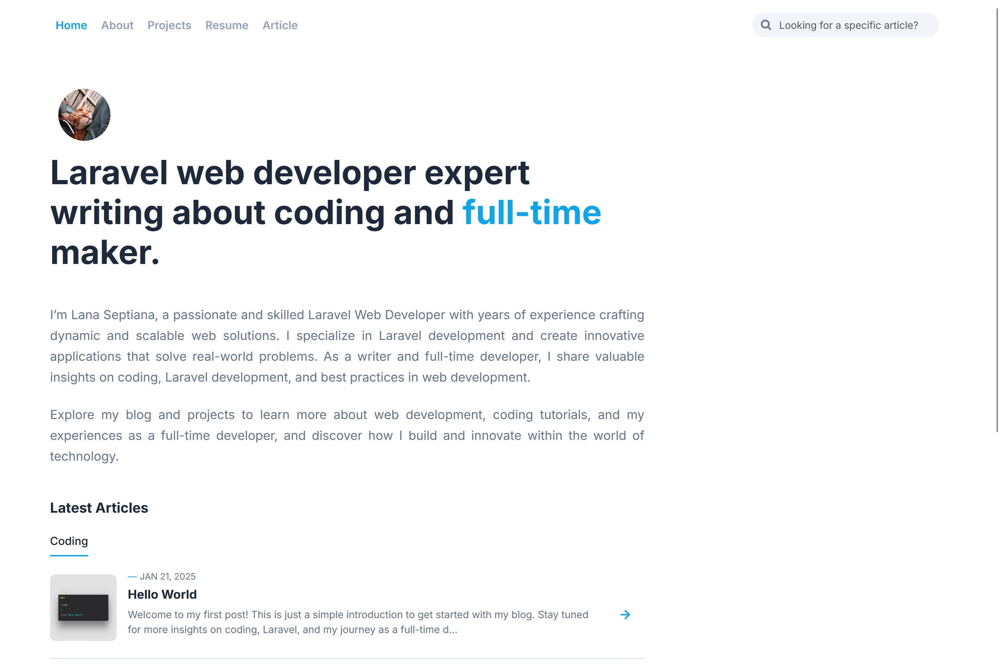
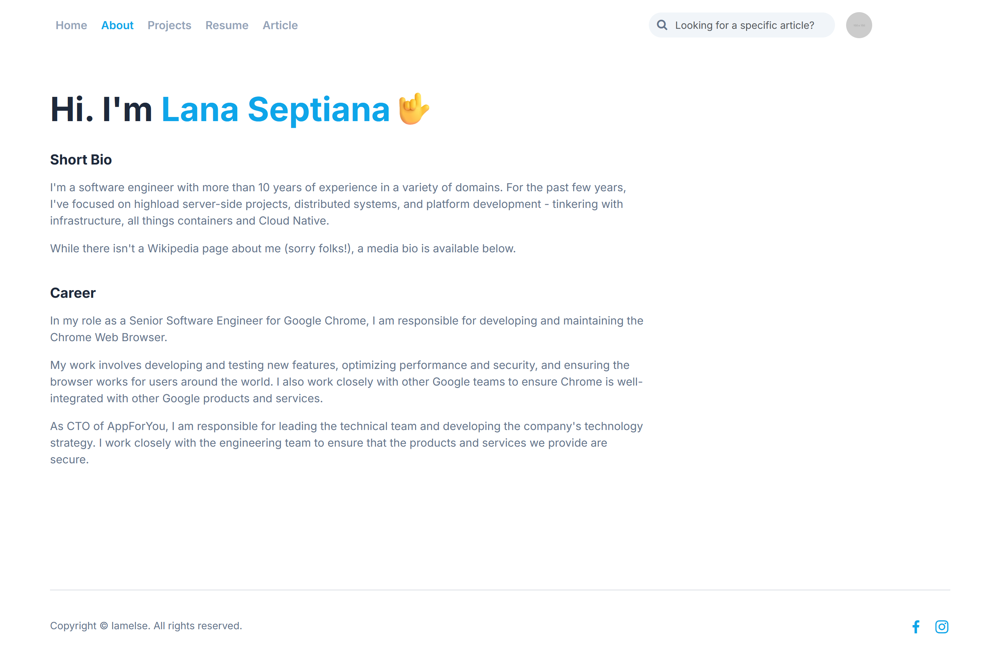
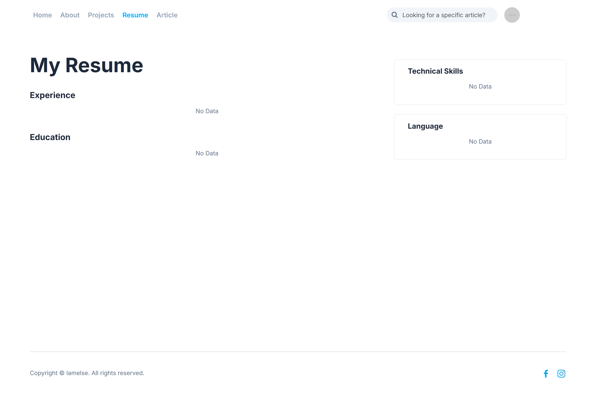
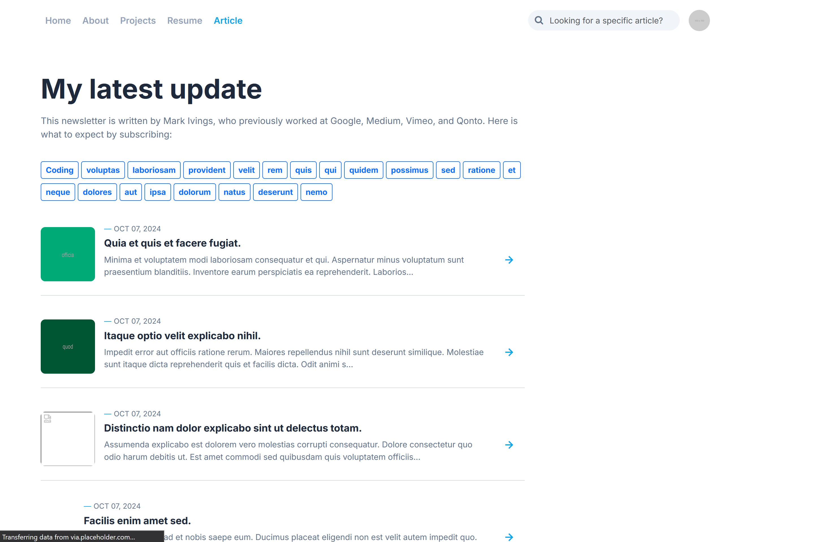

# Portfolio and Blog App

This project is a personal **Portfolio and Blog** application built using the **Laravel 10** framework. It serves as both a blog platform and a portfolio to showcase personal projects, experiences, and skills. It also features a CMS for content management and a dashboard with detailed post statistics and developer tools.

## Features

### User Features:
- **Login and Authentication**: Secure user login and registration.
- **Portfolio Showcase**: Display your projects, experience, education, and skills.
- **Blog**: Publish, edit, and manage blog posts.

### Admin Features:
- **Dashboard with Filters**:
  - View post statistics such as:
    - Post views
    - User devices
    - Operating Systems (OS)
    - Browsers
    - Countries
- **CMS**:
  - Manage Posts (create, edit, delete)
  - Manage Post Categories
  - Manage Portfolio sections (About, Projects, Experience, Education, Skills)
  - Manage Users
- **Developer Menu**:
  - Run Artisan commands from the dashboard.
  - View application logs directly from the admin panel.
- **Laravel File Manager**: Manage media files through an integrated file manager.

## Tech Stack

- **Backend:** Laravel 10 (PHP 8.2)
- **Frontend:** Blade, Bootstrap
- **Database:** MySQL
- **Other**:
  - Spatie Laravel Permissions (for user roles and permissions)
  - Laravel Task Scheduling (for post scheduling)
  - **Laravel File Manager** for managing uploaded files.

## Installation

1. Clone the repository:
   ```bash
   git clone https://github.com/your-username/portfolio-blog-app.git

2. Navigate to the project directory:
   ```bash
   cd portfolio-blog-app

3. Install dependencies
   ```bash
   composer install
   npm install

4. Copy the .env file and set up your environment variables:
   ```bash
   cp .env.example .env

5. Generate the application key:
   ```bash
   php artisan key:generate

6. Set up the database in the .env file and run migrations:
   ```bash
   php artisan migrate

7. Seed the database (optional):
   ```bash
   php artisan db:seed

8. Build the assets:
   ```bash
   npm run build

9. Serve the application:
   ```bash
   php artisan serve

10. Open your browser and navigate to http://127.0.0.1:8000.

## Package Information & Environment Variables

### Enabling Post Scheduler

To enable the post scheduler, run the following command:
   ```bash
   php artisan schedule:work
   ```
For more documentation, see the [Laravel Scheduling Documentation](https://laravel.com/docs/10.x/scheduling).

### Filesystem Disk Configuration

You can set the FILESYSTEM_DISK environment variable to either public or public_uploads.

- public: This is the default option.
- public_uploads: If you use public_uploads, all files will be uploaded directly to the public folder without needing to run php artisan storage:link. Note that this approach is not recommended.

### Visitor Tracking

To track visitors, obtain a token and enable it in your .env file by registering at [IPInfo](https://ipinfo.io/):

   ```bash
   IPINFO_TOKEN=your_token_here
   RUN_IPINFO=true # or false
   ```

### Activity Logger

You can enable or disable the activity logger using the following environment variable:

   ```bash
   ACTIVITY_LOGGER_ENABLED=true # or false
   ```

## Contribution

Feel free to fork this repository and make contributions. Pull requests are welcome!

## Screenshots







## License

This project is open-sourced software licensed under the MIT license.

Built with ❤️ using Laravel 10